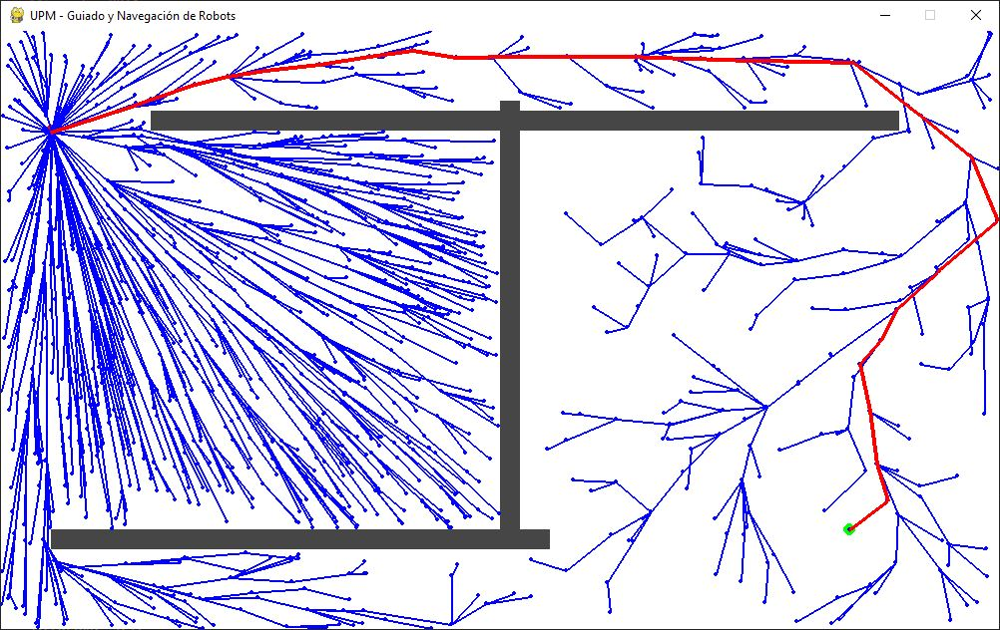

# PathPlanningDemos

Python implementations of most relevant **SMBP planners**. The aim of this code is to give a simple and educational -easy to follow, non optimal- implementation of RRTs and PRMs algorithms.
The code was developed for Robotics teaching purpose.
The planners work in a 2D euclidean space



***prof.: Miguel Hernando (2021)***   
		Universidad Politécnica de Madrid

<https://github.com/mhernando/PathPlanningDemos>

### LIB REQUIREMENTS: 
**pygame** is used for geometrical computation and visualization .

```
pip3 install pygame
```
